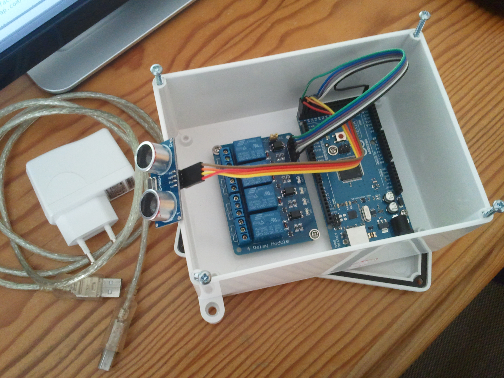

# Overview

I have a garage, and it's not only used for parking the car, but also for store
all kinds of things like tools, machines, garden related stuff and so on. One
thing that is tough is parking the car with all that stuff lying around, one
must have a good eye not to crash into something and also to keep the car far
enough from things to give space for walking around the vehicle.

The usable space in my garage for parking the car can be viewed as a rectangle,
that I'll abstract here as a horizontal line.

```
W _ _ _ _ G
```

where `W` stands for wall and `G` for the garage door.

The focus of this device is to prevent me from crashing into the back wall in my
garage since I'm used to park the car in reverse (with the trunk facing the
wall), and despite the wall I still have stuff in front of it in the ground
level which does not give me a clear view when to stop the car.

So one day I woke up and since I had an [Arduino][arduino] [Mega 2560][mega2560]
board lying around, I thought OK, why not use the Arduino to solve this problem.
I've started thinking on what would I need to do it, the first thing that came
to mind was how I would detect that the vehicle was getting closer to an
obstacle, well the ultrasonic sensor is the answer since it can measure the
distance to an obstacle. But in my case I can't place the sensor on the back
wall since I have stuff in front of it. OK then I thought about those parking
lot ceiling sensors in the supermarket that detect if a car is parked or not.
The same idea can be applied here, instead of detecting that the car is close to
the wall, let's just detect that the car is below the sensor at some point and
that crossing over corresponds to a danger situation of crashing into the wall.

Now one thing left was how I would alert myself that the car is below (crossing)
the sensor, well some LED's and a buzzer will do the trick, but since I want
this to be cooler, fancier and visible enough from the other side of the garage,
why not build a semaphore using 12V LED MR16 bulbs like the ones people usually
use in bathrooms ceilings. Also, I would need some jumper cables to connect
things.

OK now that things were planed the two remaining tasks where: programming the
Arduino; and where I would put the Arduino, a relay module needed for operating
the 12V LED bulbs since Arduino Mega 2560 runs at 5V, the ultrasonic sensor, the
bulbs and the buzzer.

For the Arduino, relay module and ultrasonic sensor I used a plastic box with
16x17x7cm. For the MR16 bulbs and the buzzer I will make a wooden box. Below is
a picture of things taking form.

<!--suppress HtmlUnknownAttribute -->
<figure markdown>
  { width=500 }
  <figcaption>Pulse assembly</figcaption>
</figure>

Below we have the full list of items used to build the device:

- Arduino Mega/Nano/Uno (Running at 5V)
- 5V Relay Module with at least 3 relays
- Jumper Cables
- Plastic Box + Wooden Box
- 2 MR16 12V LED Bulbs
- 12V Buzzer
- 12V Power Adapter for the bulbs and buzzer
- 5V USB power adapter for Arduino
- USB Cable A Male to B Male for connecting the power adapter to the Arduino
- A cable with 4 conductors for connecting the positive lead of the 2 bulbs and
  buzzer to the relay module and one for common ground

Now follows an operation example for you to see how the device works. The
operation is really simple, if the ultrasonic sensor detects a vehicle in range,
it turns on a red light and starts beeping in order to alert that the vehicle
should not move further. If no vehicle is detected a green light is turned on
and no beeping is produced. The ultrasonic sensor must be placed on the ceiling
and in the opposite side of a garage door.

| Garage Layout | Description            | Green Light | Red Light | Buzzer |
|---------------|------------------------|-------------|-----------|--------|
| W _ S _ _ G   | Empty Garage           | On          | Off       | Off    |
| W _ S _ V G   | Vehicle Parked OK      | On          | Off       | Off    |
| W _ S V _ G   | Vehicle Parked OK      | On          | Off       | Off    |
| W _ V _ _ G   | Vehicle Below Sensor   | Off         | On        | On     |
| W V S _ _ G   | Vehicle Crossed Sensor | Off         | On        | On     |

**(W - Wall, S - Sensor, G - Garage Door, V - Vehicle)**

On the first one the garage is empty hence the green light is on and the red
light and buzzer are off. On the second and third ones the vehicle is inside the
garage and is considered parked correctly, since it is between the sensor and
the garage door, so the green light is on, the red light and the buzzer are off.
The last two are considered a wrong parking situation because in the fourth one
the car is below the sensor and on the fifth the vehicle crossed the sensor,
hence the green light is off and the red light and buzzer are on in order to
alert the driver.

<figure markdown>
<iframe style="width: 500px; height: 375px" src="https://www.youtube.com/embed/2pm2MEYWfsA" allowfullscreen></iframe>
<figcaption>Pulse Working</figcaption>
</figure>

[arduino]: http://arduino.cc/

[mega2560]: http://www.arduino.cc/en/Main/ArduinoBoardMega2560